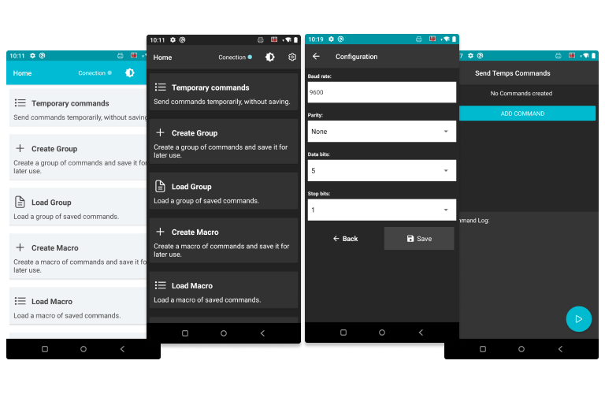
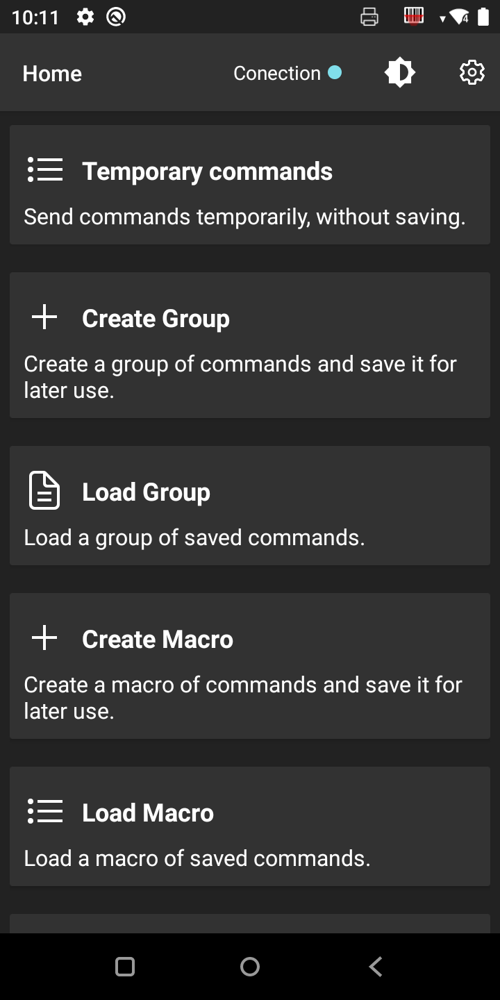
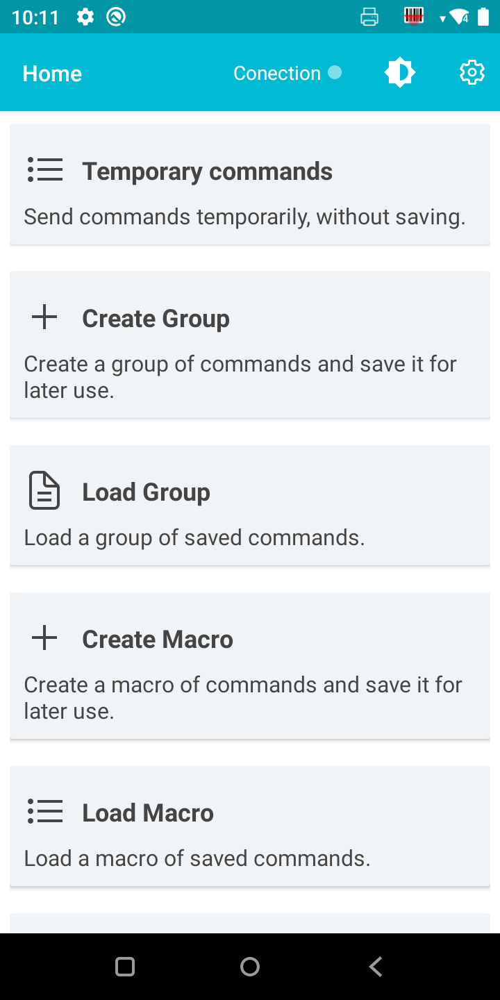

## RN USB Serial
 
Application in React Native (Android), for sending commands in hexadecimal for Serial USB.

## Project Status
This project is currently in development. User can configure the serial connection in the configuration view where you can select the speed of Rate, Parity, Data Bits and Stop Bits.

#### In the application you can create:

**Temporary:** Commands that will be created but not saved. It can be used to test communication using 1 or 2 commands.

**Macros:** A set of commands to be sent in the configured order and interval. Macros can be saved.

**Groups:** They are groups of commands and Macros that will be sent in a time interval, depending on the configuration. Being able to send a various command macros.

## Project Screen Shot(s)

 

 

## Installation and Setup Instructions

Clone down this repository. You will need `node` and `npm` installed globally on your machine.  

Installation:

`npm install`  or `yarn install`

To Run Test Suite:  

`npm test`  

To Start app:

Run connect the phone (on USB debug Mode) or run the android emulador.

`npm run android` (on linux `npm run android-linux`)

 
#### TODO
- 
- 

### ES

Aplicación en React Native (Android), para el envió de comandos en hexadecimal vía Serial USB.

## Estatus del proyecto
Este proyecto está actualmente en desarrollo. El usuario puede configurar la conexión serial en la vista de configuración donde puede seleccionar la Rate, Parity, Data Bits y Stop Bits. Luego de configurar puede empezar a enviar comandos al dispositivo.

#### En la aplicacion puedes crear:

**Temporary:** Commands that will be created but not saved. It can be used to test communication using 1 or 2 commands.

**Macros:** A set of commands to be sent in the configured order and interval. Macros can be saved.

**Groups:** They are groups of commands and Macros that will be sent in a time interval, depending on the configuration. Being able to send a various command macros.

## Instruciones de Instalacion y inicializacion

Clona este repositorio. Necesitará `node` y `npm` instalados globalmente en su máquina.

Instalacion:

`npm install`  or `yarn install`

Correr los Test:  

`npm test`  

Iniciar la aplicacion:

Ejecute conectar el teléfono (en modo de depuración USB) o ejecute el emulador de Android.

`npm run android` (en linux `npm run android-linux`)

 #### TODO
- 
- 

 